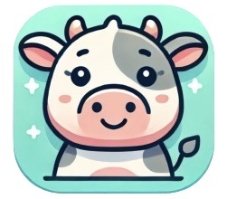
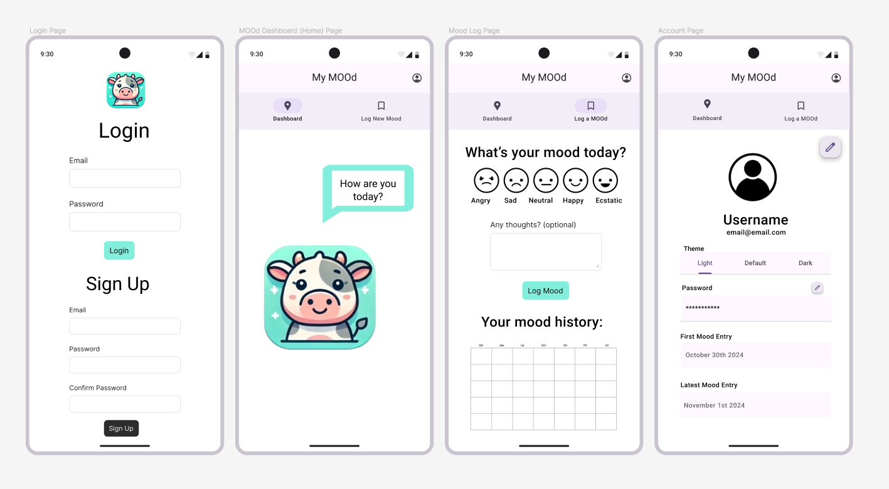
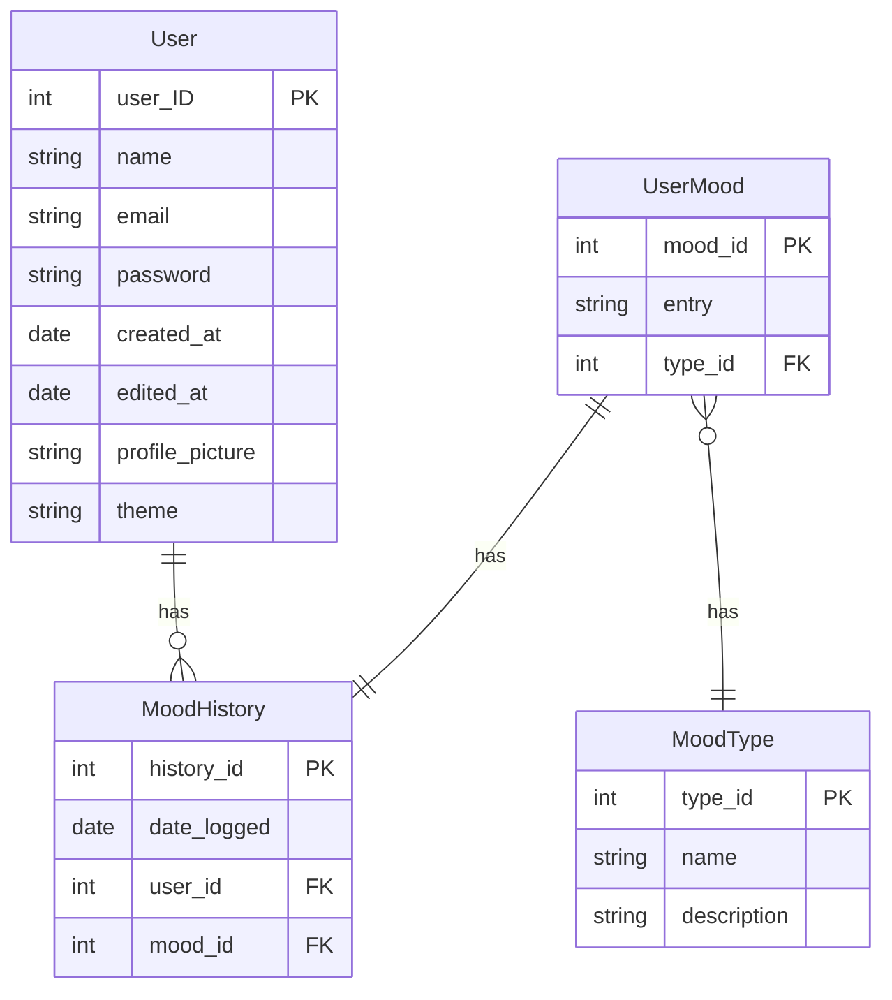

# Project Proposal
## Team composition: Hana Louiza Moussaoui, Taryn Beaupre, Ryan Wiwcharyk
#### Application Name: MOOd

#### Application Logo: 

#### Description: 
MOOd is a kotlin application with the cutest little cow friend that lets you input your daily mood, give you AI-powered suggestions to support you, and manage a simple user account. The app has multiple themes the user can pick from, and provides a comforting safe space for users to journal their feelings.

#### Application scope:

###### Audience: 

- The application is internal, so it is meant for individuals to use on their local computer or for employees to use within a company, for example.

###### Purpose: 

- To encourage mental wellness within a company or other group by allowing users to track their mood daily and receive personalized suggestions from the integrated AI.
  
###### Accessibility: 

- Restricted to internal use, meaning only authorized users within the organization can access it.
  
###### Features: 

- User authentication
- Mood tracking (User can enter up to two moods a day)
- AI-powered messages/quotes
- Account management (profile picture, username, password)
- View a historical log of the mood entries
- View statistics about the user's mood entries

#### Application Layout:

#### Four screens: 

- Sign in page: Allows the user to login or create a new account.
- Homepage: Displays a personalized message to the user encouraging them to log their mood for the day if they haven’t already, or gives them AI-Powered suggestions based on the mood they logged. 
	- Mood Logging Page: Allows the user to log their mood for the day and shows a calendar view of the moods of the past month. 
	- My Account Page: Allows the user to view their username and password and change it if necessary. 
- Navigation: Buttons allow the user to navigate between the views.
- Local Database: One “User” table with ID, username and password, preferred theme. One “Mood” table with mood logged, user ID and date logged.

#### Parameters to be saved: 

Light or dark theme

#### AI Integration: 

AI will be used to write custom messages to the user depending on the mood they entered that day. 

#### Database Schema

